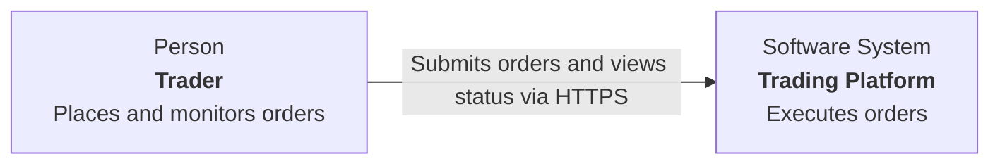

# C4 documentation output contract

Use the repository's established architecture documentation layout and notation
when present. Otherwise use this default:

```text
docs/architecture/c4/
├── README.md
├── system-context.md
├── containers.md
├── components/
│   └── <container-id>.md
├── dynamic/
│   └── <scenario-id>.md
└── deployment/
    └── <environment-id>.md
```

Create only files that add value. For a scoped component task, a single
component document plus an updated index can be sufficient.

## Documentation index

Include:

1. Purpose and model scope.
2. Current-state or proposed-state status.
3. A reading order with links and intended audiences.
4. A compact system/container inventory.
5. Notation and stable-ID conventions.
6. Evidence method and last verification date.
7. Known gaps and ownership or update guidance.

Do not duplicate the full contents of each view in the index.

## Diagram document template

````markdown
# <Diagram type> for <scope>

> Status: Current state | Proposed state
> Verified: YYYY-MM-DD

## Purpose and audience

<What question this view answers and for whom.>

## Scope

<Boundary, included elements, and important exclusions.>

## Diagram

```mermaid
<diagram source>
```

## Key

<Element types, colours/styles, boundaries, relationship semantics.>

## Element catalog

| ID | Type | Name | Responsibility | Technology | Confidence |
|---|---|---|---|---|---|

## Relationship catalog

| Source | Destination | Intent | Technology/protocol | Confidence |
|---|---|---|---|---|

## Evidence

| Claim | Evidence |
|---|---|
| <element or relationship> | [`path/to/source.ext`](../../../path/to/source.ext) |

## Assumptions and unknowns

- <Explicit assumption, unknown, or coverage limit.>
````

Adapt heading depth when embedding a view in a larger document. Keep the
semantic sections even when the diagram notation already contains titles or
descriptions.

## Diagram source conventions

### Mermaid

Use stable, sanitized node IDs and human-readable labels. Use subgraphs for
system/container boundaries. Put the C4 type, name, responsibility, and
technology in each element label where practical. Prefer left-to-right layouts
for wide flows and top-to-bottom layouts for deep hierarchies.

Use explicit labels on every edge:



Mermaid's dedicated C4 syntax is acceptable only when the target renderer
supports it. Ordinary flowcharts are more portable.

### C4-PlantUML

Use repository-local includes when available. Avoid introducing a runtime
dependency on an unpinned remote include. Keep element aliases stable across
files and preserve the narrative sections from the document template.

### Structurizr DSL

Define elements and relationships once in the model, then create filtered views.
Use stable identifiers and explicit descriptions/technologies. Keep the
workspace file beside a Markdown index that explains scope, evidence, gaps, and
rendering instructions.

## Evidence links

Use repository-relative source paths so committed documentation survives across
machines. Link to the narrowest durable source:

- entry point or composition root for runtime containers;
- route/client/handler/configuration for interfaces;
- schema/migration/repository configuration for data stores;
- infrastructure or deployment definition for deployment nodes;
- focused test for important behavior.

Avoid line-number links in committed documents because they drift. Use symbols
or short evidence notes when several files support one claim.

## Large models

If a diagram exceeds roughly 15–20 primary elements or becomes hard to scan:

1. Remove details that do not answer the view's question.
2. Group only when the group has a real architectural meaning.
3. Split by system, container, capability, environment, or scenario.
4. Link the resulting views from the index.

Do not use an unreadable "entire codebase" diagram as proof of completeness.
Represent broad coverage with a navigable set of coherent views.

## Proposed architecture

Use a separate file or view for proposed architecture when possible. If current
and proposed elements must share a diagram, use an explicit visual convention
and repeat the distinction in the catalogs. Record decisions still requiring
approval; do not present them as established architecture.
