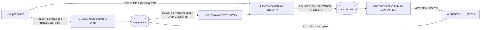

# Plan: scalable live run telemetry

Status: implemented pending capacity certification, September 19, 2026. The
bounded permit, snapshot, multiplexing, and fixed-shard implementation is in this
repository; no capacity target is certified until the prescribed disposable-service
harness is run and recorded. Baseline: `17f6596`, which already shares and bounds
the worker PostgreSQL pool.

## Objective and agreed behavior

Remove display-rate-dependent PostgreSQL work and put explicit bounds on the
whole live path: producer state, Redis connections, publication, subscriptions,
and slow browser delivery. Certify this path at **20,000 active run producers and
20,000 simultaneously watched dashboards**, with 50,000 as the next capacity
gate. Capacity must name its hardware, payloads, process count, and Redis shards.

The user approved up to **five seconds of stale live-chart authority after a
forced stop**. Fills, execution transitions, heartbeats, and durable writes keep
their existing PostgreSQL ownership fences. Once a terminal event is observed,
the API and browser accept no further live state for that run.

This permits a small ownership cache for advisory display data. It does not make
Redis an execution authority or introduce a second distributed lease system.
The five-second bound applies to server acceptance of publication under healthy
bounded-drift clocks. A paused browser or stalled network cannot have a universal
wall-clock delivery guarantee; server queues discard expired state, terminal UI
state is final, and healthy delivery latency has a separate measured SLO.

This work targets the live telemetry path specifically. The existing one-second
durable chart policy, per-bot market ingestion, execution scheduling, account
quotas, and browser authentication traffic still need separate capacity work
before advertising 20,000 end-to-end bots. At 20,000 continuously occupied run
slots, the unchanged chart policy alone targets 1.728 billion rows/day.

## Baseline evidence before this follow-up

- `api/events/observer.py` generates three live chart events every 250 ms.
  `api/events/writer.py::publish_live` opens a database session for each;
  `api/runs/lease.py::require` performs two SELECTs, including a row lock.
  Nominal cost: 24 SELECTs/run/second, even without viewers, excluding health.
- `api/events/health/writer.py` also performs a SQL lease check before writing
  the latest feed observation to Redis. It belongs in this redesign.
- `api/http/sse/subscription.py` owns one Redis subscription connection per
  browser stream. Durable replay is bounded, but live delivery has no explicit
  application-level latest-state mailbox.
- Wallet live frames contain incremental source updates, and chart markers are
  transient. Replacing arbitrary existing frames would lose information.
- `polybot/dashboard/projection.py` samples through a history object that retains
  up to 720 points. The web worker needs current projection state, not a duplicate
  copy of every browser's rolling chart history.
- Terminal writes do not uniformly send a Redis wake. SSE's lost-wake recovery
  currently depends on 15 seconds of Pub/Sub silence; continuous live traffic
  must not postpone durable reconciliation indefinitely.
- `backend/tests/control_plane/limits_load.py` is a 15-second, four-run rehearsal.
  It uses an unfenced writer and bypasses real live HTTP delivery. Retain it as
  beta acceptance; create a separate capacity harness for this path.

## Target architecture



Keep these responsibilities separate: an ownership refresher, a live publisher,
and an API subscription hub. Existing runtime projection remains the owner of
chart meaning. Use the existing Redis client and PostgreSQL stack. No new durable
broker, outbox, mirrored run-lease keys, or generic transport framework is needed.

## 1. Process-owned, short-lived publication permits

Add one refresher to `WorkerResources`, using its existing shared session factory.
Each executing run registers its immutable run ID and execution token. A new
registration initially has no live permit.

Initial policy, defined once under `api.events.live`:

| Policy | Value |
| --- | ---: |
| Permit lifetime | 5 seconds |
| Ownership refresh interval | 2 seconds |
| Maximum registered IDs per SQL query | 500 |
| Watched chart cadence | 250 ms |
| Cached viewer-interest maximum age | 5 seconds |

For each bounded batch:

1. Record monotonic sample start and read the relevant Redis server's `TIME`.
2. Execute one unlocked PostgreSQL SELECT for the registered IDs. Validate the
   execution token, allowed execution status, and at least five seconds of
   remaining database lease. Compare lease timestamps with the database clock.
3. Accept results only for the same registrations that are still active after
   the query. A completed registration can never be resurrected by a late result.
4. Grant an immutable permit ending at sample-start plus five seconds, not
   query-completion plus five seconds. Discard already-expired results.
5. Invalidate missing, terminal, mismatched, or insufficient-headroom results.
   A failed batch cannot renew a permit; conservatively invalidate its permits.

Run batches without overlap and stagger work across worker processes. Use short
READ COMMITTED transactions and release the session after each batch. Do not
hold a connection or transaction for a permit's lifetime. Runtime heartbeats
continue independently at their existing cadence.

The current 30-second execution lease provides ample headroom. Unusually short
lease configurations must suppress live telemetry when they cannot provide the
required headroom; they must never silently lengthen a permit. Report that
configuration clearly during startup.

There is **zero SQL/session creation inside live publication or feed-health
storage**. Background query volume is approximately
`sum(ceil(registered_runs_in_process_and_shard / 500)) / 2` SELECTs/second,
independent of chart frequency. For example, 20 worker processes with 1,000
registered runs each and four evenly used shards require about 40 such
SELECTs/second, instead of the present nominal 480,000 live-chart SELECTs/second.
Count round-up effects and rows read; do not advertise this as zero total SQL.

### Deadline enforcement at Redis

A local check alone cannot prevent a delayed Redis command from executing after
its permit expires. Use a short, parameterized Lua script to compare Redis time
with the original deadline and then publish or store health. Never compute a new
five-second deadline when sending, retrying, or reconnecting.

Conservative clock mapping for a sample is:

```text
local_deadline = sample_started_monotonic + 5 seconds
redis_deadline = sampled_redis_time + 5 seconds - elapsed_TIME_roundtrip
```

Round elapsed time upward. The permit is bound to its Redis shard as well as its
run registration. A shard change requires a fresh sample. Redis scripts remain
short and bounded: expiry check plus one publication or health update, not a
loop over all runs. Use the client's script facilities and test script-cache
loss explicitly. Do not retry an ambiguous publication with a renewed deadline.

Use one publication generation and an increasing sequence for the entire run
registration so consumers reject duplicate or reordered snapshots. Permit
refresh, Redis reconnect, and script-cache loss never reset either. Execution
tokens remain internal; do not expose them as browser credentials. Include the
internal publication deadline so the API hub
can conservatively discard expired queued frames using a cached shard-clock
mapping, without a Redis request per delivered frame. Clock mappings are
invalidated on reconnect and detected clock discontinuities.

Redis clock rollback beyond the monitored drift budget and arbitrary network
stalls are outside a hard real-time guarantee. Detect clock discontinuities,
invalidate permits/mappings, and suppress telemetry until fresh sampling works.
Failure tests must distinguish this assumption from guarantees enforced by code.

## 2. Make live data safely replaceable

Replace the separate market/equity/wallet live publications with one typed
snapshot containing current market values, equity, sample time, and latest
available stream health. Reuse existing payload types and valuation logic.
Health retains its actual observation timestamp: redisplaying an old observation
must not make it healthy again.

Live snapshots contain replaceable display state, with no transient markers
(the reused market-point marker field is empty). Wallet timeline entries and
trade markers are reconstructed from committed durable events/samples. Remove
the redundant incremental live-wallet path instead of building another replay
or deduplication protocol around it. This is an intentional public live-contract
change; regenerate Python/OpenAPI/TypeScript contracts together.

This deliberately removes best-effort wallet/marker previews ahead of persistence.
It does not upgrade the existing observer queue into a lossless event log: queue
saturation and persistence errors already can lose telemetry. A committed record
is recoverable; an uncommitted preview is not. Keep those failures observable and
do not describe durable replay as recovering data that never reached PostgreSQL.

Preserve durable wallet source identity and marker semantics. Do not clear pending
markers before the corresponding sample is accepted by the bounded durable queue.
Preserve their original sample timestamps; retrying admission must not move a
trade to a later time bucket. Bound retained annotation state and report overflow
through the observer failure path rather than introducing an unbounded retry
cache. Test saturated queues as well as successful reconciliation. The browser must
prefer durable samples for the same timestamp, including their markers. A late
live snapshot cannot overwrite richer durable history. Durable cursor IDs and
live sequence numbers remain distinct.

Keep a single owner of current valuation, stale values, and pending markers.
Separate current-state sampling from optional history retention so web workers
retain only the state needed to produce their next sample. CLI and browser
history remain bounded at their existing limits. Do not copy valuation formulas
into a web-specific implementation or change settlement semantics.

The existing one-second durable sampling still happens without viewers and
retains accumulated markers. Viewer demand changes only high-frequency live
projection/serialization/publication. Graceful shutdown still drains accepted
durable events and the final sample before the terminal event.

## 3. Bound producer work and skip unwatched charts

`WorkerResources` owns the publisher and its Redis clients. Each observer hands
it a replaceable pending snapshot; runtime callbacks never wait for network I/O.
Maintain at most one pending snapshot and one in-flight publication per registered
run, within a bounded process-wide set of in-flight publications. Encode once per
publication. A slow Redis service causes
coalescing or suppression, not a FIFO backlog or one new task per frame.

Initial bounds: at most eight in-flight publications per worker/shard, at most
64 KiB per encoded live snapshot, and no unbounded retry buffer. Measure typical
and maximum payloads against this bound; oversized state is rejected visibly,
not truncated into apparently complete data. Keep source schemas independently
bounded. Existing market/token caps remain in force.

Discover demand with batched `PUBSUB NUMSUB` on the live shard, at the background
refresh cadence. Live channels have a distinct namespace from the existing
durable `run:<id>` channels, including when both use the same Redis server.
The API hub subscribes to a live channel only while it has local viewers;
the worker needs only a zero/nonzero subscriber hint. No per-frame interest
query and no extra viewer lease registry are necessary. Expired or unavailable
interest observations suppress live work. Interest is never authorization.

After the API observes the last viewer leaving and removes its subscription,
high-frequency live work stops within five seconds under healthy control I/O.
A new viewer gets durable hydration immediately and live state after the next
interest/ownership refresh; healthy first-live-state target is 2.5 seconds.
Feed-health collection/storage continues without viewers, through the same
permit-gated, SQL-free publication boundary. Health storage atomically rejects
older observations and duplicate sequences; a delayed write cannot replace newer
health. Derive remaining record TTL from the original observation age, never from
its retry or redisplay time. Already-expired observations cannot renew a record.

## 4. Multiplex subscriptions and bound slow clients

Replace per-request `RunSubscription` ownership with a lifespan-owned API hub:

- One Pub/Sub connection per live Redis shard per API process, plus one
  process-owned multiplexed durable-wake connection, subscribes to the union of
  locally watched runs. No per-viewer Pub/Sub connection remains in either lane.
- Subscribe on the first authorized local viewer and unsubscribe after the last.
  Serialize subscription changes through the hub; do not race reads and commands
  from independently owned request objects.
- Decode and encode the shared SSE snapshot once in the hub. Share immutable
  bytes among viewers. Each viewer retains one pending latest live snapshot
  reference, at most one in-flight send, and a coalesced durable wake/cursor
  indication. It never accumulates a history of unsent live frames.
- Durable pages remain ordered, bounded, and cursor-replayable. Never coalesce
  durable records or put them in the replaceable live slot.
- Authorize before subscribing and preserve the current session-revocation
  deadline. A hub subscription does not authorize every viewer attached to it.
- Set an initial two-second HTTP send deadline and close slow streams so browser reconnect can replay
  durable history. Latest live state replaces missed intermediate pictures.
- Once terminal is found, clear live state, emit terminal in durable order, and
  close. The frontend keeps terminal state final despite delayed callbacks.

Bound Redis's own Pub/Sub output buffers too: initial per-connection hard limit
16 MiB, soft limit 4 MiB for five seconds, verified in the deployment manifest.
An overloaded hub is disconnected, drops obsolete pending live state, reconnects
with bounded backoff, and resubscribes; durable cursors recover committed events.
Test actual transport backpressure through the HTTP server/proxy, not just a fast
in-memory consumer. Include Redis and socket buffers in memory measurements.

Make durable reconciliation run on an independent wall-clock deadline, retaining
the existing 15-second fallback bound even during continuous live traffic.
Terminal writers should send a best-effort wake after their database transaction
commits, including worker completion, recovery, and operator/deletion paths.
Failure of that wake never rolls back or prevents a durable terminal transition.
The deadline remains the correctness fallback, so no reliable outbox is needed.

This step shares subscriptions, not database result caches. Per-viewer durable
replay/authentication SQL remains visible in integrated measurements and belongs
to the broader read-path capacity budget.

## 5. Give the live transport an explicit scale-out unit

Support a fixed configured list of standard Redis live shards; one entry may
reuse the current Redis deployment. Route live channels and latest feed-health
keys by a deterministic hash of run ID. Use the same small routing owner for
worker publication, viewer-interest reads, API subscriptions, and operational
health reads. Control-plane queues, request limits, and durable wake channels
remain on their existing Redis service.

This uses the pinned client's ordinary async Pub/Sub support and keeps `TIME`,
interest counts, health, and live publication on the same server. The current
`redis==5.2.1` async client must not be assumed to support cluster-aware sharded
subscriptions merely because it exposes an `SPUBLISH` command.

Bound each process's pools explicitly; connection count grows with processes
and configured shards, never runs or viewers. Give every deployment the same
ordered shard configuration and namespace identity. Changing the shard map is a
coordinated deployment with live-stream reconnection and fresh permits. Online
resharding and seamless topology migration are not part of this design.

A dedicated telemetry Redis deployment can separate its bandwidth from Taskiq
and admission traffic. Do not claim that adding API workers makes one Redis
server's bandwidth unbounded. Ordinary Pub/Sub does not retain messages; durable
history continues to provide recovery. Redis Cluster sharded Pub/Sub is a future
deployment alternative only if a verified client and measured need justify
replacing the fixed-shard routing.

## Delivery sequence and ownership

Deliver in this order, with each step including its focused correctness tests:

1. **Permit foundation and health path:** add policy, typed permits, refresher,
   Redis deadline operations and worker lifespan wiring. Split durable and live
   writers. Cover forced stop, expired ownership, late responses and shutdown.
2. **Snapshot contract and producer bounds:** introduce the combined snapshot,
   latest-state publisher, current-only worker projection, demand suppression,
   and frontend reconciliation. Remove obsolete live delta code in the same
   coordinated contract change.
3. **Subscription hub and terminal behavior:** multiplex connections, bound
   per-viewer state, make terminal final, and fix time-based reconciliation and
   post-commit wakes. Preserve authorization and durable replay.
4. **Deployment and scale proof:** finish fixed-shard configuration/resource
   budgets, run the production-path load harness, tune bounded defaults from
   measurements, and record supported capacities and hardware.

Primary code owners:

| Responsibility | Modules |
| --- | --- |
| Live policy, permits, publisher, Redis boundary | New focused `backend/src/api/events/live/` modules |
| Durable-only event writer | `backend/src/api/events/writer.py` |
| Latest health writes/reads | `backend/src/api/events/health/` and operational health consumers |
| Observer and snapshot projection | `backend/src/api/events/observer.py`, `events/projection/live.py` |
| Current projection versus retained history | `backend/src/polybot/dashboard/` |
| Worker lifetime | `backend/src/api/execution/worker/resources.py`, `lifecycle.py` |
| API hub, authorization, replay | `backend/src/api/http/sse/`, API lifespan dependencies |
| Post-commit terminal notifications | Run lifecycle, recovery, operator/deletion orchestration |
| Wire schema and browser merge | Event contracts, generated clients, `frontend/src/lib/runs/events/`, `frontend/src/lib/charts/history.ts` |
| Configuration and connection budgets | Deployment settings, Compose/Ansible, deployment runbook |

Keep package initializers free of barrel exports. Share finite reasons, limits,
wire fields, and routing rules through their smallest owning module. No change
to Polymarket adapters or protocol behavior is needed, so implementation does not
require new Polymarket protocol decisions.

## Acceptance: correctness before capacity

Deterministic unit and real PostgreSQL/Redis integration tests must establish:

- Wrong/unregistered tokens never receive permits; expired database leases and
  terminal rows cannot refresh them. Fill/durable/heartbeat rejection stays strict.
- A forced stop immediately after refresh cannot extend the old permit. Delayed
  SQL responses, unregister/re-register races, timeout retries, and delayed Redis
  execution cannot restart its five-second lifetime.
- Live publication and health storage execute no SQL or pool checkouts. Changing
  live cadence from 1 Hz to 4 Hz to 20 Hz does not increase background SQL.
- Redis loss/restart/script-cache loss, database loss, clock discontinuities,
  and worker cancellation suppress live updates without inventing ownership or
  changing trading outcomes. Health failures remain distinguishable from healthy
  cached data.
- Latest-state replacement preserves durable wallet identities and markers.
  Duplicate/out-of-order/oversized frames and cross-run frames are rejected.
- Continuous live traffic cannot hide terminal history or postpone authorization
  checks. Lost terminal wakes recover on the independent deadline.
- Slow clients, reconnect storms and repeated subscribe/unsubscribe cycles do not
  grow pending frames, tasks, connections, or retained projections without bounds.
- No-viewer runs emit zero high-frequency live snapshot bytes after the demand
  bound, while durable sampling and actual health observations continue.

Rewrite the existing immediate-live-fence assertions to the explicitly approved
permit contract. Retain all strict execution and durable-event assertions;
passing tests by deleting stale-worker coverage is not acceptance.

## Capacity workload and release gates

Create a new disposable-services harness using the actual observer, permit
refresher, publisher, Redis scripts, API hub, HTTP SSE framing, authorization,
and browser merge fixtures. Do not use the bare unfenced writer as a substitute.
Use synthetic market inputs so this is not a Polymarket traffic test.

Two reported modes are required:

1. **Isolated live-path capacity:** real owned run rows, permit refresh, real
   publication and HTTP consumption, with a measured/substituted durable sink.
   This measures the component and must be labeled accordingly.
2. **Integrated regression:** production durable persistence, heartbeat, stop,
   authorization and replay remain enabled at a declared supported baseline.
   No simulation or disabled component may be hidden in an end-to-end claim.

The capacity runner may seed owned synthetic rows and use explicit test-only
admission settings in disposable services. Production beta limits remain intact;
neither modifying shared production policy nor bypassing per-viewer ownership is
a valid way to run the test. HTTP request/stream allowances in the harness must
be declared in the result manifest.

Exercise 1,000, 10,000, 20,000 and 50,000 active producers; 0%, 10% and 100%
watched runs; 1 and 3 viewers per watched run; and one concentrated hot-run case.
Include 1, 10 and 20 chart tokens and bursty wallet/marker traffic. The 20,000
run / 20,000 viewer / 20-token / 4 Hz case is the target gate, not just idle bots.

Run each gate for at least 30 minutes and the target for a four-hour soak with
periodic worker/API/Redis fault injections. Test both one shard and multiple
shards. Record versions, topology, CPU/RAM/network, payload-size percentiles,
Redis persistence settings, all pool bounds, and background durable workload.

Declare these pass conditions before running:

| Measure | Target |
| --- | --- |
| SQL/checkouts in live publication and health writes | Exactly zero |
| Healthy watched snapshot age | p95 <= 500 ms; p99 <= 1 second |
| Healthy initial live state after subscription | <= 2.5 seconds |
| Stale publication authority | <= 5 seconds within the stated clock model |
| Publisher pending state | <= one snapshot per registered run |
| Live state per SSE viewer | <= one pending snapshot reference plus one in-flight send |
| Resource behavior after warm-up | No unbounded queue/task/connection/RSS growth |
| CPU and network headroom at certified load | At least 30% on every involved node |
| Lease safety and durable ordering | No regressions or ownership violations |

Account for bytes as well as operations. Current sample JSON with 20 realistic
token IDs and no wallet updates is about 3.8 KB per tick across the three frames:
20,000 fully watched runs at 4 Hz would send about 304 MB/s before fanout and
protocol overhead. This is a fixture measurement, not a future-payload promise.
The new snapshot reduces repeated headers and operations; sharding supplies
network capacity when all dashboards are watched. Demand suppression helps only
when some runs are unwatched. Do not silently lower refresh rates, token counts,
or freshness guarantees to pass a gate.

Collect bounded-cardinality metrics for SQL/checkouts by path, permit refresh
duration/failures, suppressed/coalesced snapshots, encoded bytes, publish latency,
snapshot age, pending slots, subscription connections, slow-client closes, event
loop lag, RSS, and heartbeat/durable latency. Avoid per-user/run metric labels.

If a gate fails, fix or provision the measured bottleneck and rerun the same
workload. The release record states the highest passed capacity; the target is
not converted into a claim simply because implementation is complete.

## Validation, rollout, and documentation

During implementation run focused event, ownership, worker-resource, SSE,
operation-fence and frontend reconciliation suites with real disposable services.
Then run `uv run pytest -ra`, `npm --prefix frontend run generate:check`,
`npm --prefix frontend run check`, and the relevant frontend/browser suites.
Add the capacity harness command and topology manifest to the deployment runbook
when implemented. Do not run scale tests against the production database.

Roll out with existing beta admission limits. Drain affected worker/API processes
for the coordinated live-wire and shard-map change; this repository does not
resume interrupted bot state. Preserve durable history for reconnect/reload.
Increase deployment capacity only for a separately measured, approved workload.

The implementation documentation-drift audit must update the web-control-plane
live contract, architectural ownership description, deployment pool/shard budgets,
operational failure signals, generated API contracts, and this plan's status.
Explicitly replace the old claim that every live publication checks PostgreSQL
with the approved five-second permit contract. Keep historical slice descriptions
clearly distinguished from current behavior.

The runtime and coordinated generated/frontend contracts now implement this plan.
Production admission allowances remain unchanged. Real-service regression tests
and small local capacity smoke runs validate implementation behavior; target-scale
certification and the four-hour soak remain unperformed until recorded on the
intended hardware. The executable runner and its limitations are documented in
[the deployment runbook](beta-deployment.md#live-telemetry-shards-and-capacity-evidence).

The principal review additionally covers invalidation during Redis TIME and SQL
sampling, cancellation during observer drain, terminal observation by another
viewer during authorization, and session-close rollback of terminal wake hints.
Subscription membership is reconciled only when it changes; readiness waits for
Redis's subscription acknowledgement. Observer shutdown shares one bounded drain
across runtime and coordinator callers. Exceeding the existing runtime cleanup
budget cancels the durable writer and reports observer failure; it cannot promise
persistence of records that did not commit within that budget.

The capacity runner's integrated mode now uses the production owned heartbeat,
stop transitions, final observer drain and post-commit terminal wakes, and requires
terminal delivery to every regular viewer. Isolated mode explicitly substitutes
both the durable sink and execution heartbeat. Both modes require live delivery
to every requested viewer; no-viewer workloads require zero live snapshot bytes.
Synthetic producer restarts reuse fixture execution tokens and are not evidence
of production bot-state recovery. These checks strengthen development evidence;
the target-scale certification gates above remain outstanding.

## Supporting vendor references

- [Redis Lua execution and script lifecycle](https://redis.io/docs/latest/develop/programmability/eval-intro/): scripts execute atomically and block other work while running; keep them small and handle script-cache loss.
- [Redis TIME](https://redis.io/docs/latest/commands/time/): server time supplies the publication-deadline clock.
- [Redis Pub/Sub](https://redis.io/docs/latest/develop/pubsub/): delivery is at-most-once, and missed ephemeral messages need current-state recovery; durable history remains in PostgreSQL.

These sources describe primitives. The permit protocol, limits, capacity targets,
and fault model above are the proposed application design, not vendor guarantees.
